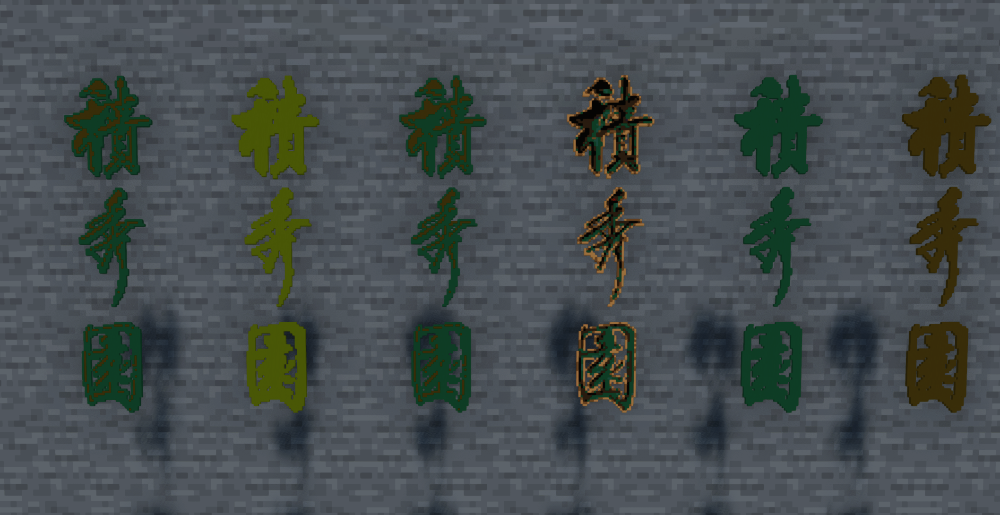

# Minecraft Display Entities Generator

本项目是**北京交通大学Minecraft还原项目**过程中的副产物，目前程序主要功能只聚焦于对**单色**的**字体**文件的显示支持，后续功能敬请期待。

将图片转换为 Minecraft **展示实体（block_display）** 指令集合的工具，支持 **16 色混凝土**，并提供 GUI 操作界面。可自定义缩放、坐标、发光、颜色选择，并进行二维优化，减少实体数量。




---

## 功能特点

- 支持 **横向/竖向模式**，竖向模式自动上下翻转输入图片以保证生成方向正确。
- **二维优化**：相邻同色区域合并为单个实体，大幅减少 Minecraft 中生成实体数量。
- **实时图片预览**：按原比例缩放，使用 `CTkImage` 支持 HighDPI 显示。
- 自定义 **像素大小（scale_factor）**，调整每个像素对应 Minecraft 中的间距。
- 可选择 **发光模式**（`brightness: block 15` 或 `0`）。
- 支持启用/禁用 **16 色 concrete**，避免伪色问题。
- 输出文件为 `.mcfunction` 或 `.txt`，可直接用于命令方块或 datapack。

---

## 安装与依赖

1. 安装 Python 3.10+
2. 安装依赖：

```bash
pip install pillow customtkinter
```

---

## 使用方法

### 方法一：

访问[Release页面](https://github.com/GoldenWaL/Minecraft_Display_Entities/releases)下载打包程序。

### 方法二：

1. 运行 GUI：

```bash
python app.py
```

2. 在 GUI 中设置参数：
   - **输入图片**：选择 PNG/JPG 等图片
   - **输出文件**：生成的 `.mcfunction` 或 `.txt` 文件
   - **基准坐标**：X / Y / Z（横向模式此坐标为图像左上角，竖向模式为图片左下角）
   - **像素大小**：控制每个像素在 Minecraft 世界中的大小
   - **发光**：是否启用发光
   - **显示方向**：横向（X-Z平面上） / 竖向（X-Y平面上）
   - **启用颜色**：可勾选需要使用的颜色

3. 点击 **生成指令**，程序会在指定路径生成 Minecraft 命令文件。
4. 将输出文件内容复制到  **datapack** 中（[**点我查看datapack制作教程**](./DATAPACK.md)），即可生成对应实体。


---

## 注意事项

- 为了性能，程序会自动合并相邻同色区域生成实体。
- 建议在世界中空旷区域测试生成，以避免实体量过多导致卡顿。

---

## 示例效果

- 支持将任意图片转换为 Minecraft block_display 指令集合
- 可生成彩色像素画、图标等

---

## 开源协议

MIT License
